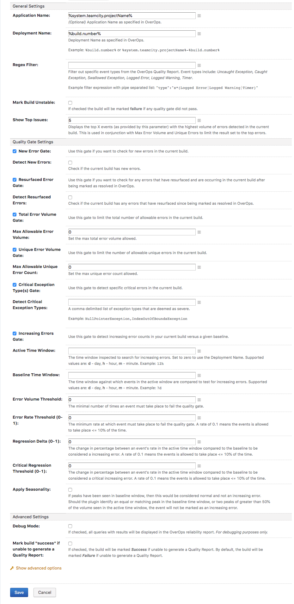

# OverOps Quality Report - TeamCity Plugin

This plugin provides a mechanism for applying OverOps severity assignment and regression analysis to new builds to allow application owners, DevOps engineers, and SREs to determine the quality of their code before promoting it into production.

Run this plugin as a post build step after all other testing is complete to generate a Quality Report that will determine the stability of the build. From the Quality Report you can drill down into each specific error using the OverOps [Automated Root Cause analysis screen](https://doc.overops.com/docs/automated-root-cause-arc) to solve the issue.

## Installation

   Prerequisites

* TeamCity version 2019.1
* Java version 1.8+

Install the OverOps Query Plugins List through the Adminstration Page. From the TeamCity Administration Page, select Plugins List → Browse plugins repository → [JetBrains Plugins](https://plugins.jetbrains.com/teamcity) → Search for OverOps plugin → click the get button → select TeamCity server.

## OverOps Plugin Configuration

After installing the OverOps Plugin, configure it to connect to OverOps.
From the TeamCity homepage select your project → Edit Project Settings → select Build Configuration → Build Step → Add Build Step → Select OverOps from the Runner type drop down.

### API URL

The complete URL of the OverOps API, including port. `https://api.overops.com` for SaaS or `http://host.domain.com:8080` for an on prem setup

### Environment ID

The OverOps environment identifier (e.g. S12345)

### API Token

The OverOps REST API token to use for authentication. This can be obtained from the OverOps dashboard under Settings → Account

### Application Name

*(Optional)* Application Name as specified in OverOps

**Example:** `%system.teamcity.projectName%`

### Deployment Name

Deployment Name as specified in OverOps or use TeamCity environment variables.

**Example:** `%build.number%` or `%system.teamcity.projectName%-%build.number%`

### Regex Filter

Filter out specific event types from the OverOps Quality Report. Event types include: *Uncaught Exception, Caught Exception, Swallowed Exception, Logged Error, Logged Warning, Timer*

**Example:** `"type":"s*(Logged Error|Logged Warning|Timer)"`

### Mark Build Unstable

If checked the build will be marked **failure** if any quality gate did not pass.

### Show Top Issues

Displays the top X events (as provided by this parameter) with the highest volume of errors detected in the current build. This is used in conjunction with Max Error Volume and Unique Errors to limit the result set to the top errors.

### New Error Gate

Detect all new errors in the build.

### Resurfaced Error Gate

Detect all resurfaced errors in the build.

### Total Error Volume Gate

Set the max total error volume allowed.

### Unique Error Volume Gate

Set the max unique error volume allowed.

### Critical Exception Type Gate

A comma delimited list of exception types that are deemed as severe.

**Example:** `NullPointerException,IndexOutOfBoundsException`

### Increasing Errors Gate

Detect increasing error counts in your current build versus a given baseline.

#### Combines the following parameters

* Error Volume Threshold
* Error Rate Threshold
* Regression Delta
* Critical Regression Threshold
* Apply Seasonality

### Active Time Window

The time window inspected to search for increasing errors. Set to zero to use the Deployment Name. Supported values are: **d** - day, **h** - hour, **m** - minute.

**Example:** `12h`

### Baseline Time Window (d - day, h - hour, m - minute)

The time window against which events in the active window are compared to test for increasing errors. Supported values are: **d** - day, **h** - hour, **m** - minute.

**Example:** `7d`

### Event Volume Threshold

The minimal number of times an event must take place to fail the quality gate.

### Event Rate Threshold (0-1)

The minimum rate at which event must take place to fail the quality gate. A rate of 0.1 means the events is allowed to take place <= 10% of the time.

### Regression Delta (0-1)

The change in percentage between an event's rate in the active time window compared to the baseline to be considered a increasing error. A rate of 0.1 means the events is allowed to take place <= 10% of the time.

### Critical Regression Threshold (0-1)

The change in percentage between an event's rate in the active time window compared to the baseline to be considered a critical increasing error. A rate of 0.1 means the events is allowed to take place <= 10% of the time.

### Apply Seasonality

If peaks have been seen in baseline window, then this would be considered normal and not an increasing error. Should the plugin identify an equal or matching peak in the baseline time window, or two peaks of greater than 50% of the volume seen in the active time window, the event will not be marked as an increasing error.

### Debug Mode

If checked, all queries and results will be displayed in the build log. *For debugging purposes only.*

### Mark build "success" if unable to generate a Quality Report

If checked, the build will be marked **Success** if unable to generate a Quality Report. By default, the build will be marked **Failure** if unable to generate a Quality Report.
